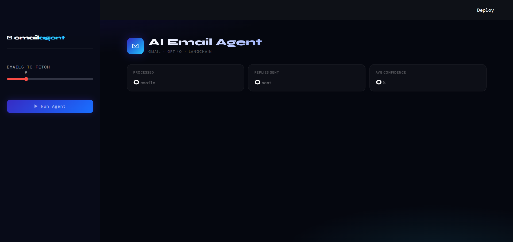
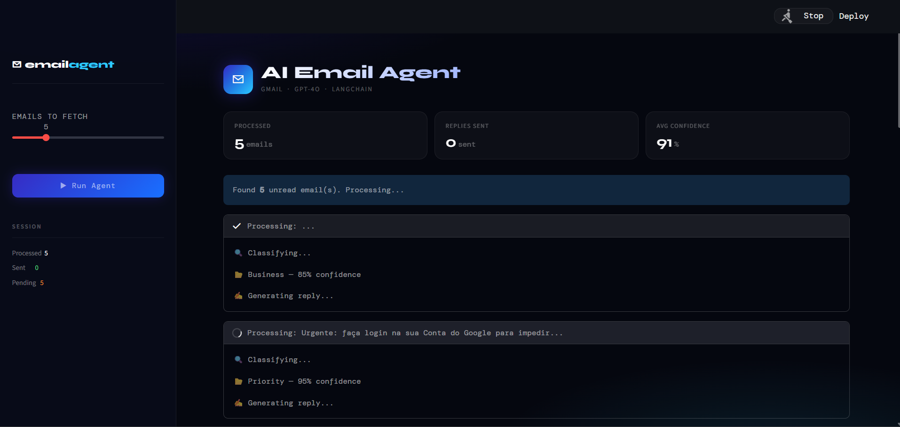
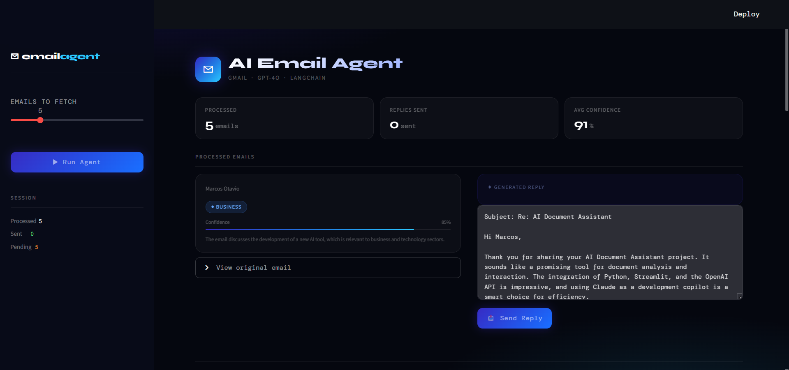

# ✉️ AI Email Agent

An AI-powered email agent that monitors your Gmail inbox, classifies incoming emails into categories, and generates professional replies using GPT-4o — with human-in-loop review before sending.

Built with Python, LangChain, Gmail API and Streamlit.

---

## Features

- 📥 Reads unread emails from Gmail via OAuth 2.0
- 🏷️ Classifies emails into: Business, Priority, Administrative, Education, Newsletter, Events
- 📊 Confidence score per classification with visual bar
- ✍️ Generates professional, human-like replies using GPT-4o
- 👁️ Human-in-loop — edit the reply before sending
- 🏷️ Automatically applies Gmail labels per category
- 📈 Session stats: processed, sent, avg confidence

---

## Screenshots

### Dashboard


### Processing


### Results


---

## Tech Stack

| Tool | Purpose |
|---|---|
| [Streamlit](https://streamlit.io/) | Web interface |
| [LangChain](https://www.langchain.com/) | LLM chain orchestration |
| [OpenAI GPT-4o](https://platform.openai.com/) | Email classification + reply generation |
| [Gmail API](https://developers.google.com/gmail/api) | OAuth 2.0 — read, send, label emails |
| [Pydantic](https://docs.pydantic.dev/) | Structured output parsing |

---

## Project Structure

```
ai-email-agent/
├── app.py                  # Streamlit dashboard
├── credentials.json        # Gmail OAuth credentials (not committed)
├── .env                    # API keys (not committed)
├── requirements.txt
├── agent/
│   ├── gmail_client.py     # Gmail API — fetch, send, label
│   ├── classifier.py       # GPT-4o classification chain
│   └── responder.py        # GPT-4o reply generation chain
└── config/
    └── settings.py         # Pydantic settings — loads from .env
```

---

## Setup

### 1. Clone the repository

```bash
git clone https://github.com/marcosotaviox/ai-email-agent.git
cd ai-email-agent
```

### 2. Install dependencies

```bash
pip install -r requirements.txt
```

### 3. Configure Gmail OAuth

1. Go to [Google Cloud Console](https://console.cloud.google.com)
2. Create a project and enable the **Gmail API**
3. Create an **OAuth 2.0 Client ID** (Desktop app)
4. Download the credentials and save as `credentials.json` in the project root
5. Add your Gmail account as a test user in the OAuth consent screen

### 4. Configure environment variables

Create a `.env` file in the project root:

```
OPENAI_API_KEY=sk-...
```

### 5. Run

```bash
streamlit run app.py
```

On first run, a browser window will open to authorise Gmail access. After that, a `token.json` is saved locally for future sessions.

---

## How it works

```
Gmail Inbox
    ↓
fetch_unread_emails()       # Gmail API — reads up to N unread emails
    ↓
classify(email)             # GPT-4o → category + confidence + reasoning
    ↓
respond(email, category)    # GPT-4o → professional reply draft
    ↓
Human review                # Edit the reply in the UI before sending
    ↓
send_reply() + apply_label() # Gmail API — sends reply, applies label, marks as read
```

---

## Email Categories

| Category | Description |
|---|---|
| Business | Work-related, proposals, partnerships |
| Priority | Urgent matters requiring immediate attention |
| Administrative | Account notices, billing, system emails |
| Education | Courses, learning platforms, academic content |
| Newsletter | Marketing, promotions, subscriptions |
| Events | Invitations, meetups, conferences |

---

## Security

- API key is loaded from `.env` and never exposed in the UI
- `credentials.json` and `token.json` are excluded from version control via `.gitignore`
- OAuth token is stored locally and refreshed automatically

---

## Roadmap

- [ ] Filter emails by category in the UI
- [ ] Tabs for Pending vs Sent
- [ ] Persistent session history (JSON)
- [ ] Category distribution chart
- [ ] Auto-polling mode

---

## Licence

MIT